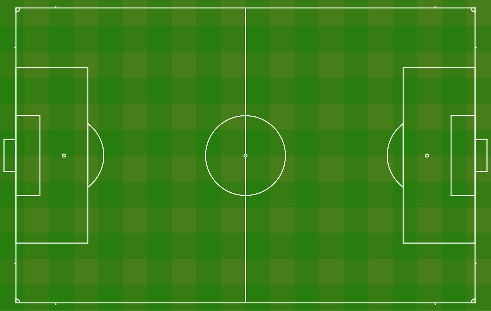

# Football Leagues DataSet

1. Overview

2. [The Csv file fields Description](#csv-file-fields-description)

3. [Describing the structure of the complex formats in the CSV File fields](#structure-of-the-complex-formats-in-the-csv-file-fields)

4. [Example](#example)

5. [Disclaimer](#disclaimer)

# Overview

This repository contains historical football data from three main European football leagues: La Liga (Spain), Serie A (Italy), Champions league and the Premier League (England). The data spans several decades, providing valuable insights into the performance of teams and players over time.

## La Liga Information

- Historical Football Data: The data starts from the 1929/1930 season and ends with the 2018/2019 season.

- Seasons Under Revision\*:

  - 1928/1929

  - 1996/1997

## Serie A Information

- Historical Football Data: The data starts from the 1928/1929 season and ends with the 2018/2019 season.

- Seasons Under Revision\*:

  - 1928/1929

  - 1945/1946

  - 1947/1948

  - 1952/1953

  - 1964/1965

  - 1965/1966

## Premier League Information

- Historical Football Data: The data starts from the 1946/1947 season and ends with the 2019/2020 season.

- Seasons Under Revision\*:

  - 1987/1988

### Csv file fields Description

|                    |                                                                                  |
| :----------------: | :------------------------------------------------------------------------------: |
|     **Column**     |                                  **Description**                                 |
|      leagueid      |                  League ID (SERIEA/LALIGA/PRML - Premier League)                 |
|      awaygoals     |                         Goals scored by the visiting team                        |
|   awaygoalsplayer  |                   Goals scored by players of the visiting team                   |
|  awayassistplayer  |                       Assists made by visiting team players                      |
|   awaycardsyellow  |                Yellow cards issued to players of the visiting team               |
|    awaycardsred    |                 Red cards issued to players of the visiting team                 |
| awaycardsyellowred | Players who received red cards after previous yellow cards for the visiting team |
|  awaysubstitution  |        Substitutions for the visiting team (player in, player out, minute)       |
|      awayteam      |                             Name of the visiting team                            |
|   awaypossession   |                Percentage of ball possession by the visiting team                |
|  awayshotsontarget |                       Shots on target by the visiting team                       |
|     awaycorners    |                        Corners taken by the visiting team                        |
|      awayfouls     |                       Fouls committed by the visiting team                       |
|   awaygoliesaves   |                   Goals saved by the visiting team's goalkeeper                  |
|      dategame      |        Date and time of the match (timestamp format for database purposes)       |
|      shortdate     |                      Date of the match in YYYY-MM-DD format                      |
|       season       |                Season in which the match took place (YYYY/YYYY+1)                |
|      homegoals     |                           Goals scored by the home team                          |
|   homegoalsplayer  |                     Goals scored by players of the home team                     |
|  homeassistplayer  |                         Assists made by home team players                        |
|   homecardsyellow  |                  Yellow cards issued to players of the home team                 |
|    homecardsred    |                   Red cards issued to players of the home team                   |
| homecardsyellowred |   Players who received red cards after previous yellow cards for the home team   |
|  homesubstitution  |          Substitutions for the home team (player in, player out, minute)         |
|      hometeam      |                               Name of the home team                              |
|   homepossession   |                  Percentage of ball possession by the home team                  |
|  homeshotsontarget |                         Shots on target by the home team                         |
|     homecorners    |                          Corners taken by the home team                          |
|      homefouls     |                         Fouls committed by the home team                         |
|   homegoliesaves   |                     Goals saved by the home team's goalkeeper                    |
|      matchweek     |                     Match week in which the match took place                     |
|     attendance     |                              Attendance at the match                             |

  

### Structure of the complex formats in the CSV File fields

|                    |                                                                                                                                                           |
| :----------------: | :-------------------------------------------------------------------------------------------------------------------------------------------------------: |
|     **Column**     |                                                                         **Format**                                                                        |
|   awaygoalsplayer  |                           "{'player-1':'minutes when the goal took place', ..., 'player-n':'minutes when the goal took place'}"                           |
|  awayassistplayer  |                  "{'player-1':'minute of the game when assistance took place', ..., 'player-n':'minute when the assistance took place'}"                  |
|   awaycardsyellow  |                            "{'player-1':'minute of the game when card issued', ..., 'player-n':'minute when the card issued'}"                            |
|    awaycardsred    |                                                                  idem to awaycardsyellow                                                                  |
| awaycardsyellowred |                                                                  idem to awaycardsyellow                                                                  |
|  awaysubstitution  | "{'player\_In-1':'player\_Out-1, minute when the substitution took place', ..., 'player\_In-3':'player\_Out-3, minute when the substitution took place'}" |
|   homegoalsplayer  |                                                                  idem to awaygoalsplayer                                                                  |
|  homeassistplayer  |                                                                  idem to awayassistplayer                                                                 |
|   homecardsyellow  |                                                                  idem to awaycardsyellow                                                                  |
|    homecardsred    |                                                                  idem to awaycardsyellow                                                                  |
| homecardsyellowred |                                                                  idem to awaycardsyellow                                                                  |
|  homesubstitution  |                                                                  idem to awaysubstitution                                                                 |

  

### Example

- Example of `awaygoalsplayer`: "{'G. Wijnaldum':'9', 'M. Salah':'68', 'S. Mané':'81'}"

- Example of `awaysubstitution`: "{'A. El Mohamady':'Jota,66', 'Douglas Luiz':'M. Nakamba,81', 'K. Davis':'F. Guilbert,85'}"

  
This dataset is a valuable resource for football enthusiasts, analysts, and researchers interested in studying the history and trends of European football leagues.

### Disclaimer

The data provided in this repository is gathered from various sources and is offered for informational purposes only. While we make every effort to ensure the accuracy and reliability of the data, it is possible that errors or discrepancies may occur due to human mistakes or inconsistencies in the original sources.

We do not assume any responsibility for the completeness, accuracy, or reliability of the data provided. Users are encouraged to verify the information independently and use it at their own discretion.

We do not accept any liability for any loss, damage, or inconvenience caused by reliance on the information provided in this repository.

## Seasons Under Revision

- When a season is included under revision, that despite our efforts to review the data, there are significant inconsistencies that may affect its reliability, therefore that information is not included in the dataset. However we can provide it, please contact us via email.

For any questions, concerns, or corrections regarding the data, please feel free to contact us at [**ldipotet@scadip.com**](mailto:ldipotet@scadip.com)

Thank you for using our Europe Football Leagues Data Set! 

We hope you find it informative and insightful.

  

